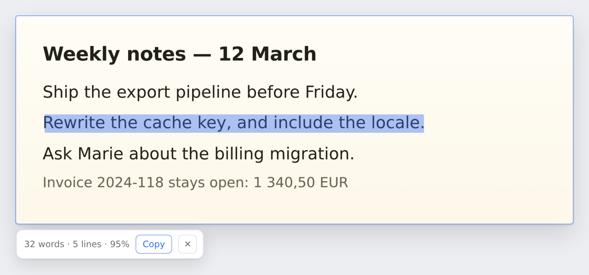

<div align="center">


# textlift

### Right-click any image in Chrome and read its text.

The words become selectable over the picture, the way a PDF viewer shows the text
of a scan. Everything runs on your machine.


[](https://github.com/theophile-wallez/textlift/releases/latest)
[](https://github.com/theophile-wallez/textlift/actions/workflows/release.yml)



</div>

---

## What is textlift?

**textlift** turns the text inside a picture into text you can select. Right-click
an image, choose **Scan the text of this image**, and a transparent layer of text
lands over the pixels: drag across a line, press `Ctrl+C`, paste it anywhere.

The recognition runs in WebAssembly inside the extension. No image and no text
ever reaches a server, and the whole thing works with the network off.

> **Vibe-coded:** this project is 100% vibe-coded — built end-to-end with an AI
> coding agent, guided by intuition and momentum rather than a formal spec. Treat
> it accordingly: a fast-moving experiment, not battle-tested production software.
> Read the code before you trust it.

## Highlights

- **🖱️ One right click** — a menu item on every image of every page.
- **✂️ Select, do not retype** — one transparent line of text per line of the
  image, so the browser gives you the selection, the highlight and the copy that
  you already know. A `Copy` button takes the whole text.
- **🔲 Scan any region** — the toolbar button and `Alt+Shift+S` open a crosshair.
  Drag over a CSS background, a canvas, a video frame, a chart, or a paragraph
  that refuses to be selected.
- **📴 Nothing leaves the machine** — Tesseract runs in WebAssembly next to the
  page. The extension reaches one host, and only to fetch a language that you
  asked for.
- **🌍 28 languages** — English travels inside the package. Every other language
  downloads once, then Chrome keeps it.
- **🔍 Small text still reads** — a small image grows before the scan, which is the
  single change that helps the accuracy most.
- **🧯 A second way in** — an image host that blocks a direct read does not stop
  the scan: the extension reads the pixels of the screen instead.

## Install

Download the latest package, then load it:

1. Take `textlift-<version>.zip` from the
   [latest release](https://github.com/theophile-wallez/textlift/releases/latest).
2. Unzip it into a directory that stays on your disk.
3. Open `chrome://extensions` and turn on **Developer mode**.
4. Choose **Load unpacked** and select that directory.

Or build it yourself:

```sh
npm install
npm run build      # writes dist/, and collects the engine on the first run
```

Then load `dist` the same way. `npm run build:watch` rebuilds on every change.

## Use it

| Action                           | How                                              |
| -------------------------------- | ------------------------------------------------ |
| Read one image                   | Right-click it → **Scan the text of this image** |
| Read a part of the screen        | `Alt+Shift+S`, or the toolbar button, then drag  |
| Copy one line                    | Drag across it, then `Ctrl+C`                    |
| Copy everything                  | The `Copy` button of the toolbar                 |
| Close the overlay                | `Escape`, or the `✕` button                      |
| Languages, enlargement, and more | Right-click the toolbar button → **Options**     |

## How it works

```
 content script ──▶ service worker ──▶ offscreen document ──▶ Tesseract worker
   the overlay        the pipeline       the engine host          WebAssembly
```

| Part              | Job                                                        |
| ----------------- | ---------------------------------------------------------- |
| `src/core/`       | Pure logic: geometry, resize plan, text assembly, schemas  |
| `src/background/` | Menus, the scan pipeline, the screenshot, the routing      |
| `src/offscreen/`  | The engine and the image loader                            |
| `src/content/`    | The overlay, the region selector, the anchor of an element |
| `src/shared/`     | Messaging and settings, used by every context              |

Three decisions carry the design.

**The engine lives in an offscreen document.** Chrome stops a service worker
after 30 seconds without an event, and one scan takes longer than that. An
offscreen document is an extension page with a DOM and no lifetime limit, so the
Tesseract worker survives there. The engine stays warm between two scans, and an
alarm closes the document after five idle minutes to give back its 100 MB.

**The overlay is a text layer, not a dialog.** One transparent `<span>` per line,
placed over the pixels of that line, with a horizontal scale that squeezes the
text into the box of the line. The browser then handles the selection, the
highlight, and the copy. A repaint happens on a size change only, because a
repaint on every scroll frame would drop the selection of the user.

**A small image goes up before it goes in.** Tesseract needs a character height
of about 30 pixels. An enlargement of a small image gives the largest accuracy
increase of the whole pipeline, so `planScale` targets a short side of 1000
pixels, up to three times, inside a budget of six million pixels.

### Two ways to read the pixels

The image path fetches the bytes of the image and keeps the full resolution of
the source. When the host of the image refuses that read, the pipeline falls back
to a screenshot of the visible tab, cut to the visible part of the element. The
overlay then anchors itself to that visible part, because a clipped region under
an element anchor would stretch the text across the whole element.

The region path always uses a screenshot. It reads a rectangle of the viewport in
device pixels, so a display with a pixel ratio of 2 gives twice the detail.

### The engine inside the package

Manifest V3 forbids remote code, so the WebAssembly core and the worker script
live in the package. Training data is data and not code, so the package holds
English only and the engine downloads any other language on the first use.

| File                                   | Size    | Why                                      |
| -------------------------------------- | ------- | ---------------------------------------- |
| `tesseract-core-relaxedsimd-lstm.wasm` | 2.86 MB | The engine on Chrome 114 and later       |
| `tesseract-core-simd-lstm.wasm`        | 2.86 MB | The engine on an older Chrome            |
| `worker.min.js`                        | 0.11 MB | The bridge between the page and the core |
| `eng.traineddata.gz`                   | 1.98 MB | English                                  |

Only the LSTM cores, because the legacy Tesseract engine needs other training
data. `npm run vendor` collects them, and the build runs it when a file is
missing.

## Commands

```sh
npm run check         # format, types, build, tests — the gate before a commit
npm test              # the unit tests of src/core and of the manifest
npm run test:browser  # the end-to-end test, needs Chromium and a display
npm run build         # writes dist/
npm run build:watch   # rebuilds on every change
npm run package       # writes the ZIP of a release
npm run demo          # draws docs/demo.png again
npm run vendor        # collects the engine files again
npm run icons         # draws the icons again
```

`npm run test:browser` drives a real Chromium with the unpacked extension. It
renders a sentence, reads it back through the whole pipeline, selects the text
with the mouse, and runs a region scan at a pixel ratio of 2. Chrome loads an
unpacked extension in a headed browser only, so a machine without a display needs
`xvfb-run -a npm run test:browser`.

## Cut a release

```sh
npm version patch        # writes package.json and the tag
git push --follow-tags
```

The tag starts `.github/workflows/release.yml`. The workflow compares the tag with
the version of the package, runs every check, reads a real image in a real
browser, and attaches `textlift-<version>.zip` to the release of that tag. A tag
with a suffix, such as `v0.2.0-beta.1`, becomes a pre-release.

## Limits

- **Chrome 116 and later.** `chrome.offscreen` and `chrome.runtime.getContexts`
  arrived there.
- **The screenshot paths cover the top frame only.** A screenshot holds the whole
  tab, and this extension does not translate the coordinates of a nested frame.
- **A page can move an image with `object-position`.** The overlay assumes the
  default centre, so a moved image gets a shifted layer.
- **Tesseract reads flat text well and a photo poorly.** A rotated line, a curved
  line, and handwriting stay out of reach. The region scan with the enlargement
  on gives the best result on a hard image.

## Permissions

| Permission     | Reason                                                   |
| -------------- | -------------------------------------------------------- |
| `<all_urls>`   | Reads the bytes of an image of any host, and screenshots |
| `contextMenus` | The two menu items                                       |
| `offscreen`    | Hosts the engine outside the service worker              |
| `storage`      | The settings, and the pending region of a selection      |
| `scripting`    | Injects the overlay into a tab that Chrome loaded before |
| `alarms`       | Closes the idle engine                                   |

## Licence

MIT for this extension. Tesseract and `tesseract.js` carry the Apache 2.0
licence, and the build copies both licence files into `dist/vendor/tesseract`.
